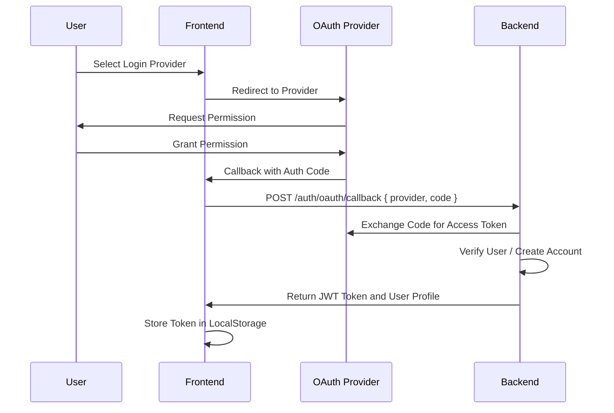
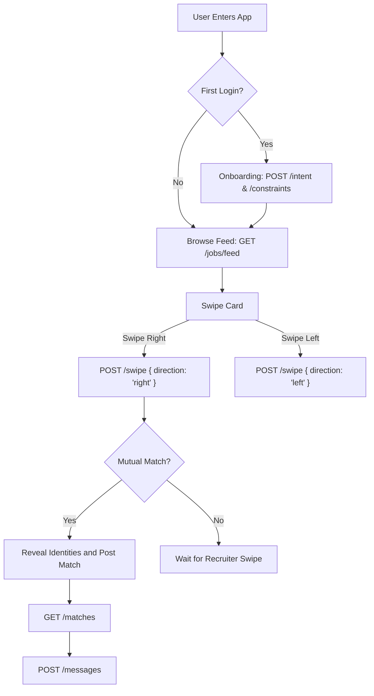

# SABER: Signal Alignment Before Exposure Reveal

SABER is a professional networking and recruitment platform designed around the principles of privacy-first interaction and intent-based matching. It ensures that identities and company names remain confidential until a mutual match is established through swiping mechanics.

## Architecture and Technology Stack

The system is built on a modern, scalable stack designed for high performance and reliability.

| Component | Technology |
| :--- | :--- |
| Backend | Node.js, Express, TypeScript |
| Database | PostgreSQL |
| ORM | Prisma |
| Authentication | OAuth 2.0 (Google, GitHub, LinkedIn), JWT |
| Deployment | Vercel (Serverless) |
| Architecture | RESTful API |
| Infrastructure | GitHub Actions (CI/CD and AI Jobs) |

---

## Core Product Rules

1. **Identity Privacy**: Candidate names and company names are hidden until a mutual match occurs.
2. **Intent-Based Exposure**: Matching is driven by candidate intents and recruiter problem statements.
3. **Hard Constraint Blocking**: Exposure in feeds is strictly controlled by candidate and job constraints.
4. **Server-Side Enforcement**: All business logic, swipe limits, and matching rules are enforced on the server.
5. **AI Explainability**: Every match profile includes explainability data detailing why the match was made.

---

## Application Flow

### Authentication Flow



### Candidate Flow



---

## API Documentation

### Base Configuration

* **Base URL**: `https://api.saber.co`
* **Authentication**: All protected endpoints require an `Authorization: Bearer <JWT_TOKEN>` header.
* **Content Type**: `application/json`

### Authentication Endpoints

#### OAuth Callback
Exchanges an OAuth authorization code for a session JWT.
* **Method**: `POST`
* **Path**: `/auth/oauth/callback`
* **Request Body**:
  ```json
  {
    "provider": "google | github | linkedin",
    "code": "auth_code_from_provider"
  }
  ```

#### Current User Profile
Retrieves the profile of the authenticated user.
* **Method**: `GET`
* **Path**: `/auth/me`

---

### Candidate Endpoints

#### Update Intent
Updates the candidate's career intent and personal "why" statement.
* **Method**: `POST`
* **Path**: `/intent`
* **Request Body**:
  ```json
  {
    "intent_text": "Looking for backend engineering roles",
    "why_text": "I want to work on distributed systems at scale"
  }
  ```

#### Update Constraints
Updates candidate preferences such as salary requirements and location.
* **Method**: `POST`
* **Path**: `/constraints`
* **Request Body**:
  ```json
  {
    "preferred_salary": 150000,
    "preferred_locations": ["New York", "Remote"],
    "remote_only": true
  }
  ```

#### Get Job Feed
Retrieves a personalized feed of jobs ranked by skill alignment.
* **Method**: `GET`
* **Path**: `/jobs/feed`

#### Job Swipe
Records a swipe action on a job posting.
* **Method**: `POST`
* **Path**: `/swipe`
* **Request Body**:
  ```json
  {
    "job_id": "uuid",
    "direction": "right | left"
  }
  ```

---

### Recruiter Endpoints

#### Create Company
Initializes a new company profile.
* **Method**: `POST`
* **Path**: `/company`
* **Request Body**:
  ```json
  {
    "name": "Tech Corp Inc",
    "website": "https://techcorp.com"
  }
  ```

#### Create Job Posting
Creates a new job with problem statements and expectations.
* **Method**: `POST`
* **Path**: `/job`
* **Request Body**:
  ```json
  {
    "company_id": "uuid",
    "problem_statement": "Scaling a message queue system",
    "expectations": "Implement an event-driven architecture",
    "non_negotiables": "Senior level Go experience",
    "skills_required": ["Go", "Kubernetes"],
    "constraints_json": {
      "salary_range": [120000, 200000],
      "location": "San Francisco"
    }
  }
  ```

#### Get Candidate Feed
Retrieves potential candidates matching the recruiter's job requirements.
* **Method**: `GET`
* **Path**: `/recruiter/feed`

#### Candidate Swipe
Recruiter's active swipe on a candidate's intent.
* **Method**: `POST`
* **Path**: `/recruiter/swipe`
* **Request Body**:
  ```json
  {
    "job_id": "uuid",
    "target_user_id": "uuid",
    "direction": "right | left"
  }
  ```

---

### Shared Lifecycle Endpoints

#### Get Matches
Retrieves all mutual matches where identities are revealed.
* **Method**: `GET`
* **Path**: `/matches`

#### Send Message
Sends an in-platform message within a specific match context.
* **Method**: `POST`
* **Path**: `/messages`
* **Request Body**:
  ```json
  {
    "match_id": "uuid",
    "content": "Message content"
  }
  ```

---

### AI and Recommendation Endpoints

These endpoints are internal and require an `X-API-KEY` header for authentication.

#### AI Data Export
Retrieves paginated data for the recommendation engine. Available for `users`, `jobs`, `swipes`, and `matches`.
* **Method**: `GET`
* **Path**: `/ai/data/{resource}?limit=100&cursor=uuid`

#### Update Recommendation Profile
Updates a user's recommendation profile based on AI processing.
* **Method**: `POST`
* **Path**: `/ai/recommendations/update`
* **Request Body**:
  ```json
  {
    "user_id": "uuid",
    "positive_signals": { "liked_skills": ["Node.js"] },
    "negative_signals": {},
    "suppression_rules": { "max_experience": 10 }
  }
  ```

---

## Infrastructure Hardening

The SABER backend includes several production-level configurations for reliability and security.

### Rate Limiting

The system implements tiered rate limiting to protect against abuse:
* **Global**: 1000 requests per 15 minutes.
* **Authentication**: 20 requests per hour per IP.
* **Swipe**: 200 swipes per hour per IP.
* **AI API**: 100 requests per 15 minutes per API Key.

### Database Indexing

Critical lookups are optimized with composite and unique indexes on:
* `Swipe(user_id, job_id, target_user_id)`
* `Job(active)`
* `User(role)`
* Direct foreign key indexes for all relations.

### Observability

Structured logging is implemented using Winston, incorporating:
* **Request IDs**: Every request is tagged with a unique UUID for traceability.
* **Standardized JSON Logs**: Optimized for cloud log aggregation.
* **Environment Validation**: System fails fast if critical environment variables are missing.

---

## Development and Deployment

### Script Reference

* `scripts/ai-cron.py`: Python script invoked by GitHub Actions every 6 hours to sync data and update recommendations.
* `scripts/create-admin.ts`: Utility to promote or seed an administrative user.

### GitHub Actions

The system uses GitHub Actions for:
1. **CI/CD**: Automated testing and deployment to Vercel.
2. **AI Jobs**: Scheduled recommendation engine runs using the internal AI API.

---

## Error Response Format

All errors return a standardized JSON structure:

```json
{
  "error": {
    "message": "Descriptive error message",
    "status": 403
  }
}
```

| HTTP Status | Description |
| :--- | :--- |
| 400 | Validation error or bad request payload. |
| 401 | Missing or invalid authorization token. |
| 403 | Authenticated but insufficient permissions for the role. |
| 429 | Rate limit exceeded. |
| 500 | Internal server error. |
